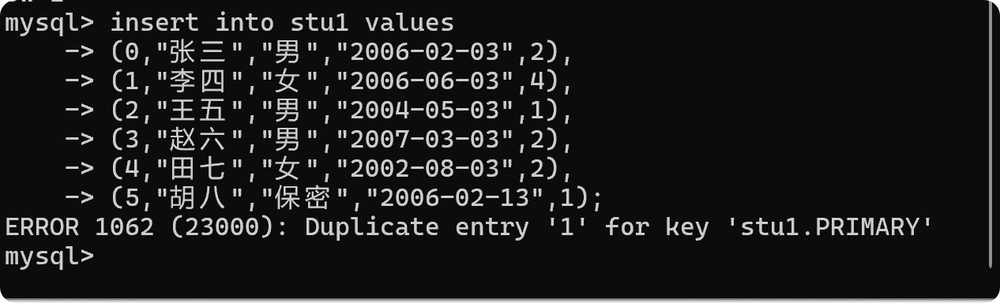
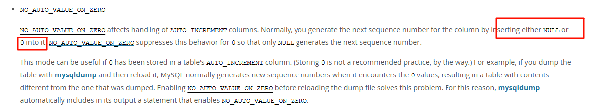

# mysql 自动自增

## 起因

今天上午，朋友给我发了一个 sql 语句，然我帮看一下为什么报错，我看到了报错信息：



第一反应就是主键重复了，但是结果并不是，知道我看了建表语句，发现 id 是`auto_increment`，我想可能与自增有关，所以我自己建了表查看了一下

```sql
CREATE TABLE `c_test` (
  `id` tinyint(4) NOT NULL AUTO_INCREMENT,
  `name` varchar(255) DEFAULT NULL,
  PRIMARY KEY (`id`)
) ENGINE=InnoDB AUTO_INCREMENT=4 DEFAULT CHARSET=utf8mb4;
```

然后手动插入了几条数据

```sql
INSERT INTO `study`.`c_test` (`id`, `name`) VALUES (0, '0');
INSERT INTO `study`.`c_test` (`id`, `name`) VALUES (1, '1');
```

我发现也是报相同的问题，因为不是提交的事务，所以第一句插入成功了，但是 id 确变成了 1，自动递增确实是从 1 开始的，但是现在我指定了 id 为 0，为什么变 1 了呢？

## 查询资料并解决

我查了网上的信息，发现说是因为 mysql 自动递增的时候会根据 null 或者 0 来判断是否自增，然后我又去看了一下 mysql 的文档：https://dev.mysql.com/doc/refman/8.0/en/sql-mode.html#sqlmode_no_auto_value_on_zero



这句话就是说当插入是 0 或者 null 时会自动生成序号，然后我查了一下当前库的`sql_mode`：

```sql
SELECT @@sql_mode
```


没有改`sql_mode`值，那确实插入 0 会变 1，导致主键重复。
