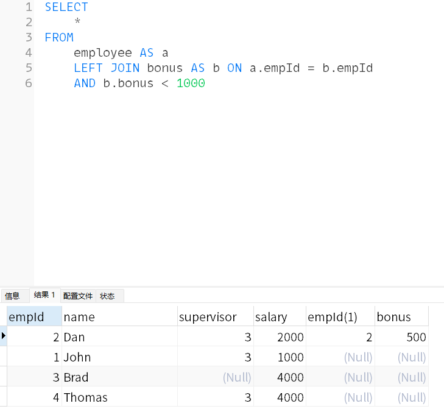

## 背景

用 leetcode 练习 MySQL 时，使用 where 和 on 进行查询时返回结果不一样。

## 实践

定义了两个表 employee、bonus，建表语句：

```sql
-- 创建员工表
CREATE TABLE Employee (
    empId INT PRIMARY KEY,
    name VARCHAR(255),
    supervisor INT,
    salary INT
);

-- 创建奖金表（empId 是 Employee.empId 的外键）
CREATE TABLE Bonus (
    empId INT PRIMARY KEY,
    bonus INT,
    FOREIGN KEY (empId) REFERENCES Employee(empId)
);
```

插入数据：

```sql
INSERT INTO `leetcode`.`employee` (`empId`, `name`, `supervisor`, `salary`) VALUES (1, 'John', 3, 1000);
INSERT INTO `leetcode`.`employee` (`empId`, `name`, `supervisor`, `salary`) VALUES (2, 'Dan', 3, 2000);
INSERT INTO `leetcode`.`employee` (`empId`, `name`, `supervisor`, `salary`) VALUES (3, 'Brad', NULL, 4000);
INSERT INTO `leetcode`.`employee` (`empId`, `name`, `supervisor`, `salary`) VALUES (4, 'Thomas', 3, 4000);
INSERT INTO `leetcode`.`bonus` (`empId`, `bonus`) VALUES (2, 500);
INSERT INTO `leetcode`.`bonus` (`empId`, `bonus`) VALUES (4, 2000);
```

查询奖金低于 1000 的员工
在 on 中写条件查询：

```sql
SELECT
	*
FROM
	employee AS a
	LEFT JOIN bonus AS b ON a.empId = b.empId
	AND b.bonus < 1000
```


在 where 中写查询条件：

```sql
SELECT *
FROM
employee AS a
LEFT JOIN bonus AS b ON a.empId = b.empId
where b.bonus < 1000
```


在 where 中会明显少记录。

## 查阅资料

我看了一些网上大神写的以及自己总结了一下：
on 的条件先进行筛选，对右表进行，然后再进行连接，再使用 where 对连接后的表进行筛选，因此 on 中添加`b.bonus < 1000`，会先选中 bonus 表中的唯一一条符合的数据，和左边进行笛卡尔积，左表中对不上的直接用 null 补全，所以会有很多 null 数据，而且导致了明明 thomas 的奖金小于 1000 也出现在了结果集中。
where 条件是对笛卡尔积进行筛选的，因此会计算乘积，然后选出其中小于 1000 的数据，但是这样会把那些奖金是 null 的人排除，

## 总结

如果想对右表限制就在 on 中添加条件，相应会导致左表在右表中无法匹配到行导致为 null，如果对左边限制就在 where 中添加条件，这样才能过滤掉，而在 on 中添加的限制左表的条件不会生效的，因为 on 只针对关联表也就是右表！
注意区分左、右连接！！！
