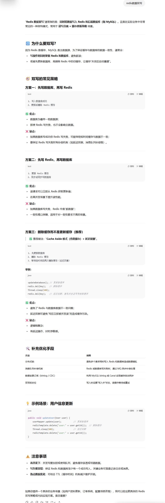
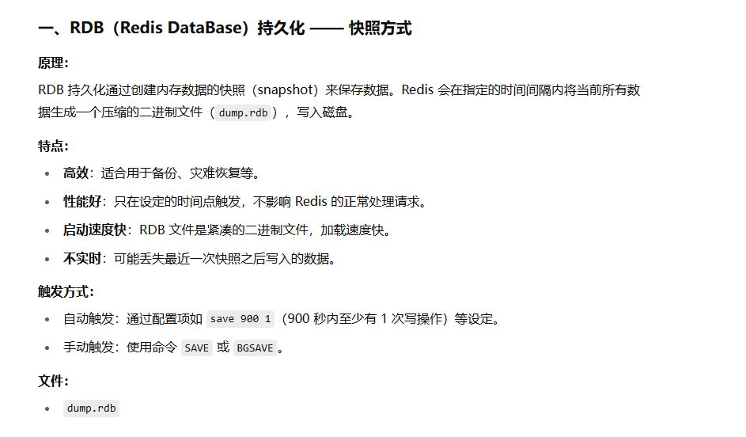
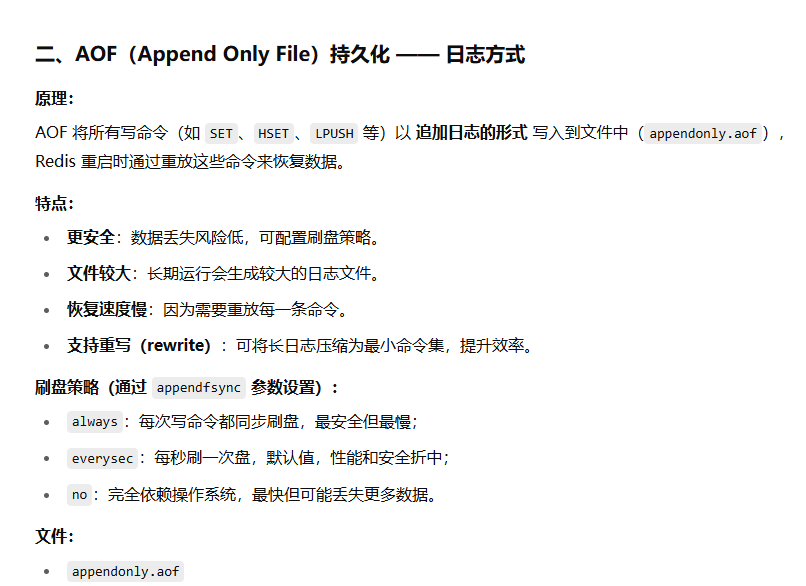

# 面试题
## redis是什么

Redis 是完全开源免费的， 遵守`BSD`协议， 是一个高性能的`key-value`数据库。

Redis 与其他`key - value`缓存产品有以下三个特点：

>   Redis 支持数据的持久化，可以将内存中的数据保存在磁盘中，重启的时候可以再次加载进行使用。
>
>   Redis 不仅仅支持简单的`key-value`类型的数据， 同时还提供`list`，`set`，`zset`，`hash`等数据结构的存
>   储。
>
>   Redis 支持数据的备份， 即`master-slave`模式的数据备份。

Redis 优势:

>   性能极高: Redis 能读的速度是 110000 次/s,写的速度是 81000 次/s 。
>
>   丰富的数据类型 : Redis 支持二进制案例的 Strings, Lists, Hashes, Sets 及Ordered Sets 数据类型操
>   作。
>
>   原子: Redis 的所有操作都是原子性的，意思就是要么成功执行要么失败完全不执行。单个操作是原子
>   性的。多个操作也支持事务，即原子性，通过 MULTI 和 EXEC 指令包起来。
>
>   丰富的特性: Redis 还支持 publish/subscribe, 通知, key 过期等等特性。

Redis 与其他 key-value 存储的不同：

>   Redis 有着更为复杂的数据结构并且提供对他们的原子性操作，这是一个不同于其他数据库的进化路
>   径。Redis 的数据类型都是基于基本数据结构的同时对程序员透明， 无需进行额外的抽象。
>
>   Redis 运行在内存中但是可以持久化到磁盘，所以在对不同数据集进行高速读写时需要权衡内存， 因为
>   数据量不能大于硬件内存。在内存数据库方面的另一个优点是，相比在磁盘上相同的复杂的数据结构，
>   在内存中操作起来非常简单，这样 Redis 可以做很多内部复杂性很强的事情。同时，在磁盘格式方面他
>   们是紧凑的以追加的方式产生的， 因为他们并不需要进行随机访问。

## redis数据双写

## Redis 的数据类型

 Redis 支持五种数据类型： string（ 字符串），hash（ 哈希）， list（ 列表）， set（ 集合） 及
sorted set（有序集合）。

## Redis 的持久化机制

Redis 提供两种持久化机制 RDB 和 AOF 机制:
RDB（Redis DataBase）持久化方式： 是指用数据集快照的方式（半持久化模式）记录 redis 数据库的所
有键值对,在某个时间点将数据写入一个临时文件， 持久化结束后， 用这个临时文件替换上次持久化的
文件， 达到数据恢复。
优点：
1、只有一个文件 dump.rdb， 方便持久化。

2、容灾性好， 一个文件可以保存到安全的磁盘。

3、性能最大化， fork 子进程来完成写操作， 让主进程继续处理命令， 所以是 IO 最大化。使用单独子
进程来进行持久化，主进程不会进行任何 IO 操作，保证了 redis 的高性能

4、相对于数据集大时， 比AOF 的启动效率更高。
缺点:
1、数据安全性低。RDB 是间隔一段时间进行持久化，如果持久化之间 redis 发生故障， 会发生数据丢
失。所以这种方式更适合数据要求不严谨的时候

AOF（Append-only file）持久化方式： 是指所有的命令行记录以 redis 命令请求协议的格式（完全持久化存储）保存为 aof 文件。
优点：
1、数据安全， aof 持久化可以配置 appendfsync 属性， 有 always， 每进行一次命令操作就记录到aof 文件中一次。
2、通过 append 模式写文件， 即使中途服务器宕机， 可以通过 redis-check-aof 工具解决数据一致性问题。
3、AOF 机制的 rewrite 模式。AOF 文件没被 rewrite 之前（ 文件过大时会对命令进行合并重写）， 可以删除其中的某些命令（ 比如误操作的 flushall）)
缺点：
1、AOF 文件比 RDB 文件大， 且恢复速度慢。
2、数据集大的时候， 比 rdb 启动效率低。

## redis过期处理

1、定时删除:在设置键的过期时间的同时，创建一个定时器 timer). 让定时器在键的过期时间来临时，立即执行对键的删除操作。
2、惰性删除:放任键过期不管，但是每次从键空间中获取键时，都检查取得的键是 否过期， 如果过期的话， 就删除该键;如果没有过期， 就返回该键。
3、定期删除:每隔一段时间程序就对数据库进行一次检查，删除里面的过期键。至 于要删除多少过期键， 以及要检查多少个数据库， 则由算法决定。

## redis事务处理

通过 MULTI、EXEC、WATCH 等命令来实现事务功能。支持将多个命令请求打包，按顺序一次性执行，执行期间不会中断处理其他客户端请求，具有原子性（Atomicity)、一致性(Consistency)和隔离性（Isolation），且在特定持久模式下具备持久性（Durability）

## Redis为什么这么快

1、完全基于内存，绝大部分请求是纯粹的内存操作，非常快速。数据存在内存中，类似于HashMap，HashMap 的优势就是查找和操作的时间复杂度都是O(1)；

2、数据结构简单，对数据操作也简单，Redis 中的数据结构是专门进行设计的；

3、采用单线程，避免了不必要的上下文切换和竞争条件，也不存在多进程或者多线程导致的切换而消耗 CPU，不用去考虑各种锁的问题，不存在加锁释放锁操作，没有因为可能出现死锁而导致的性能消耗；

4、使用多路 I/O 复用模型，非阻塞 IO；

5、使用底层模型不同，它们之间底层实现方式以及与客户端之间通信的应用协议不一样，Redis直接自己构建了 VM 机制 ，因为一般的系统调用系统函数的话，会浪费一定的时间去移动和请求；

elasticsearch深度分页,怎么解决

es适合搜索+日志，使用范围很小

购物车用Redis,redis适合热点数据：频繁访问但不频繁修改 的数据

redis的数据类型时key-value  类型的

如果存购物车数据，需要用其中的哈希类型和zset类型

redis的数据类型中字符串适合存验证码

cacahe.set(key,value)适用于字符串

订单存mysql

在Vue中用try... catch...时，只要HTTP状态码不是200就会进入catch，此时获取catch报错的状态码可以用error.response.status

bytes字节

encode 编码 将字符串转为字节，decode 解码 及那个字节转为字符串

json.loads 序列化 把json字符串转为字典

json.dumps 反序列化